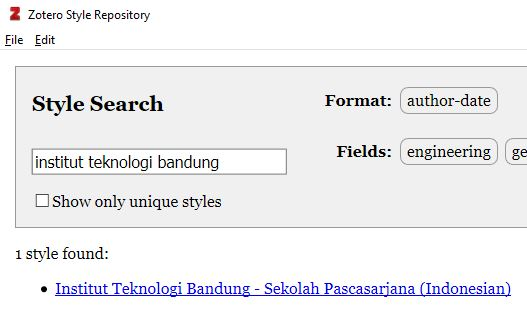
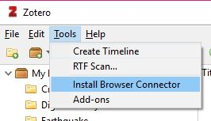
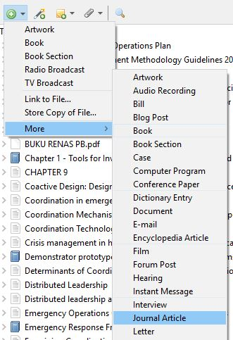

# SPs ITB Citation Style Language (CSL) Guide

Sekolah Pascasarjana (SPs) ITB provides a Citation Style Language (CSL) which can be used in supported reference manager software, to format references and bibliography in conformance with [SPs ITB guidelines for master's thesis and doctoral dissertation](http://www.sps.itb.ac.id/in/pedoman-tesis-dan-disertasi/).

SPS ITB provides tutorial to use the CSL with the following software:

* [Microsoft Word 2010/2013/2016](https://products.office.com/en/word) and [Zotero](https://www.zotero.org/), for Windows and macOS

As CSL is an open and widely supported format, it is also usable in other software, e.g. [LibreOffice](http://libreoffice.org), [Mendeley](https://mendeley.com/), and Linux-based operating systems like [Ubuntu](https://ubuntu.com/) and [Linux Mint](https://linuxmint.com/). Please refer to your reference manager's documentation on how to use this CSL in your preferred software, or you can [contribute to this documentation by submitting a GitHub pull request](https://github.com/itb-sps/csl).

## Using This CSL with Microsoft Word 2010/2013/2016 and Mendeley

### Preparation

1. Make sure you have installed **Microsoft Office 2010/2013/2016**.

2. Download and install **Zotero** from https://www.zotero.org/

3. Run Zotero.

4. Sign-up or login to your Zotero account so you can save and sync all your references easily.

6. Ensure you can see Zotero in Microsoft Word's Zotero ribbon tab.

   

7. Install **Institut Teknologi Bandung - Sekolah Pascasarjana** style, as follows:

   a. In Zotero, click **Edit > Preferences...**

   b. Click **Get additional styles...**.

      

   c. Search for "**institut teknologi bandung**"

      

   d. Click **Institut Teknologi Bandung - Sekolah Pascasarjana**

   e. Click **OK**.

8. Congratulations! Now you are ready to collect documents, insert citations, and insert a bibliography in your documents.

### Collect Documents

Before you can insert a citation, you need to collect documents first in Zotero. Although there are many ways to collect documents, this guide will describe the most common ones:

1. By adding a paper's PDF file

2. Using the Web Importer plugin (recommended)

3. Adding manually (as a last resort)

#### Collect Documents from PDF files

If you already have PDF files of the papers you want to add, simply drag-and-drop PDF files to the Zotero Desktop.

Alternatively, you can also click **Add > Store Copy of File...**

#### Collect Documents using the Web Importer plugin (recommended)

The Web Importer is the most convenient way to add documents, it will even download the PDF file for you if available.

1. [Install Zotero Browser Connector](https://www.zotero.org/download/) for your favorite browser.

   

2. After the Browser Connector add-on is installed, login to your [Zotero.org](https://www.zotero.org/) account.

3. Visit Google Search, IEEE Xplore, or your favorite journal/proceeding web site. When you want to import the document(s) that you are viewing, click the **Save to Zotero** button in your browser.

   

   Click **Save**.

4. After you have finished importing documents from the web: Open **Zotero app**, click **Sync with zotero.org** button so that you can immediately use these documents.

   Your imported documents will show up in **Zotero app** after sync is complete.

   

#### Collect Documents Manually

Sometimes the quick and easy methods do not work, or you just want to add documents manually.

1. In Zotero app, click **Add > (document type)**. Commonly used types are **Conference Proceeding** and **Journal Article**.

   

2. Input the document details.

   

3. Click **Save**.

#### Edit/Correct Document Details

Mendeley will automatically try to fill the document details, but there are cases when this information is not accurate. You can edit or correct this using the **Details** sidebar.

### Inserting Citations

1. Create a Word document for your thesis or dissertation, using the [template provided by SPs ITB](http://www.sps.itb.ac.id/in/pedoman-tesis-dan-disertasi/).

2. In **Zotero** ribbon tab, click **Document Preferences**.

   a. In **Citation Style**, choose **Institut Teknologi Bandung - Sekolah Pascasarjana**.
   b. In **Language**, select **Bahasa Indonesia** or **English** based on the language of your thesis/dissertation.

3. In the place where you want to put the citation, click **Zotero > Add/Edit Citation**.

   Type the keywords of your document (author, title, year, etc.) then double-click it or press Enter.

### Inserting Bibliography

In the place where you want to put the bibliography, click **Zotero > Add/Edit Bibliography**.

The bibliography will be inserted using syntax according to SPs ITB guidelines.

**Important:** you will still need to ensure correct formatting according to [Pedoman Tesis dan Disertasi SPs ITB](http://www.sps.itb.ac.id/in/pedoman-tesis-dan-disertasi/), because the following are not controlled by CSL:

* font and font size
* paragraph justification

## More about Zotero

Zotero has **a lot** of useful features. This tutorial only covers the basic usage.

Check out [Zotero Documentation](https://www.zotero.org/support/) for more information.

## Feedback

If you have feedback and suggestions about this CSL and/or its documentation, please [post an issue here](https://github.com/itb-sps/csl/issues) or email [hendy@hendyirawan.com](mailto:hendy@hendyirawan.com).
